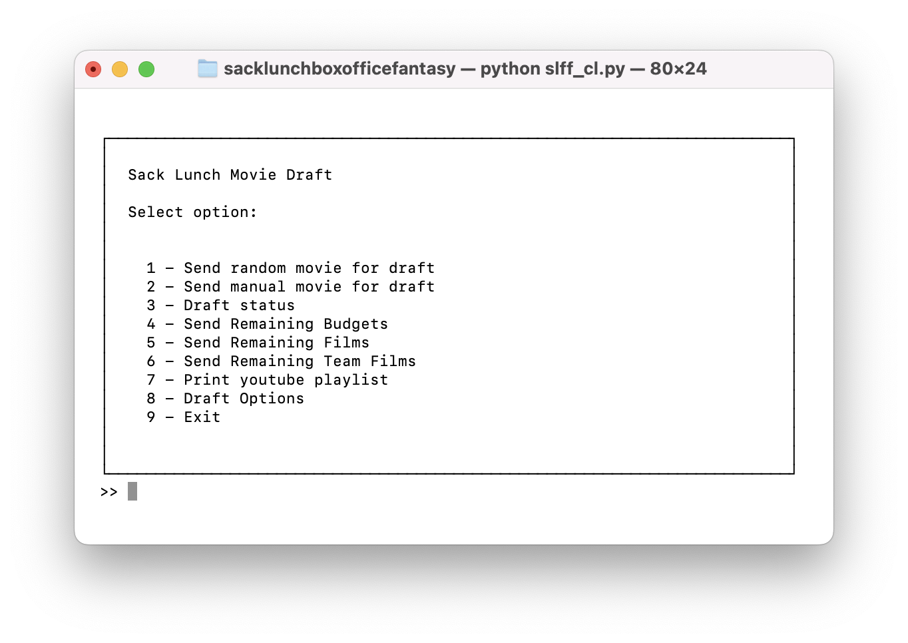
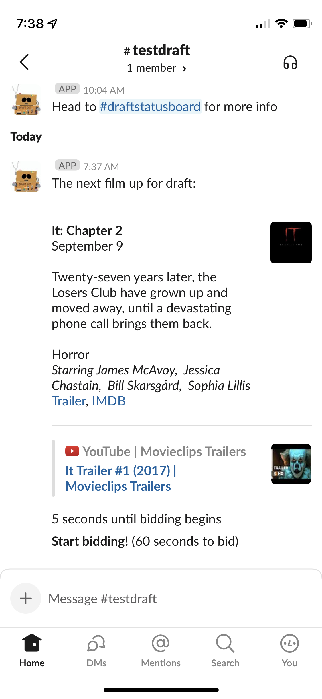
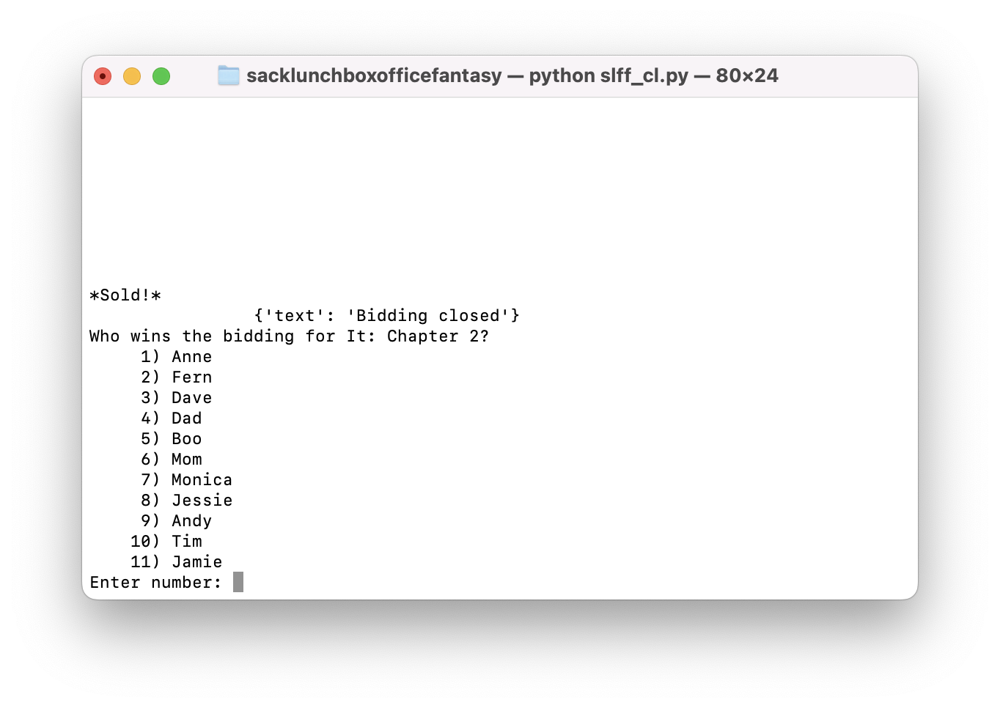
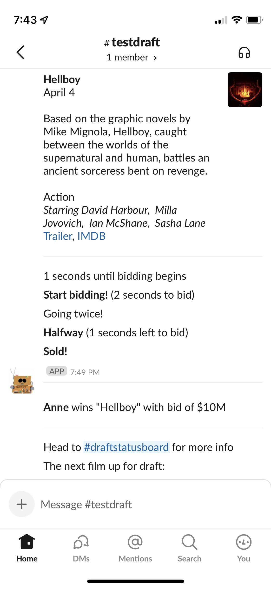
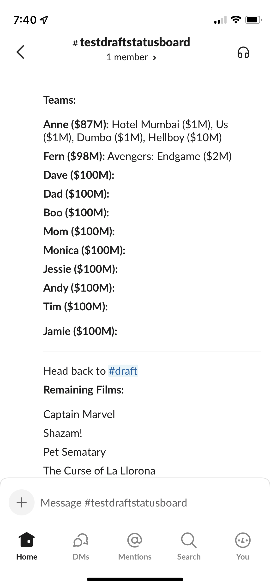

# boxoffice fantasy draft

A console application I wrote to help me run a movie draft through Slack using Webhooks

## Installation

`$ pip install git+https://bitbucket.org/<project_owner>/<project_name>`

You will need to edit the information in the yaml file in  `data/input`. A sample has been provided

You will also need to edit the .env file to provide the right environment variables, specifically OMDB API Key and the webhook urls. A sample has been provided.

## Usage
Launch the console with 

`$ python ./sacklunchboxofficefantasy/slff_cl.py`

To send a randomly chosen move for draft, use option 1 

The command line will let you know that bidding is starting, and it will send a message to the draft webhook url.

When the bidding ends, the console will ask (and ask for confirmation) of who won and for how much. 

Once entered, it will record that info and pass it to the Slack channel:

The message will reference a link to #draftstatusboard, which shows the resulting draft status.

# Project Status

Admittedly, this was created for just myself for one year. I am providing it here as a showcase. I will need to do some refactoring, specifically to generalize it, as well as cleaning it up.
